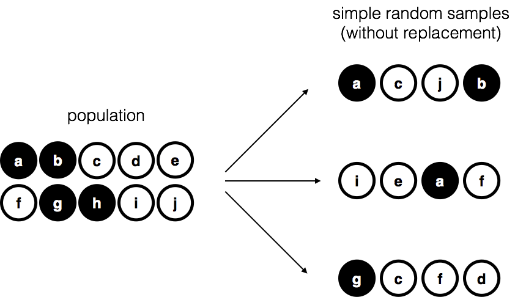
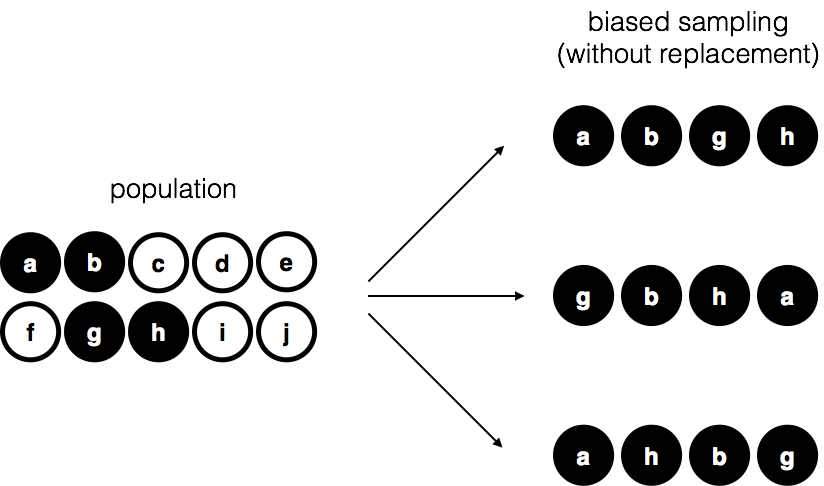
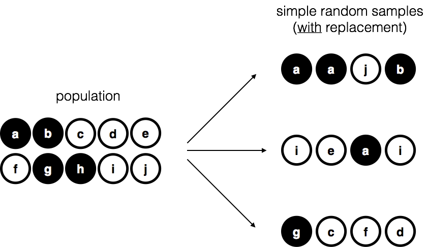
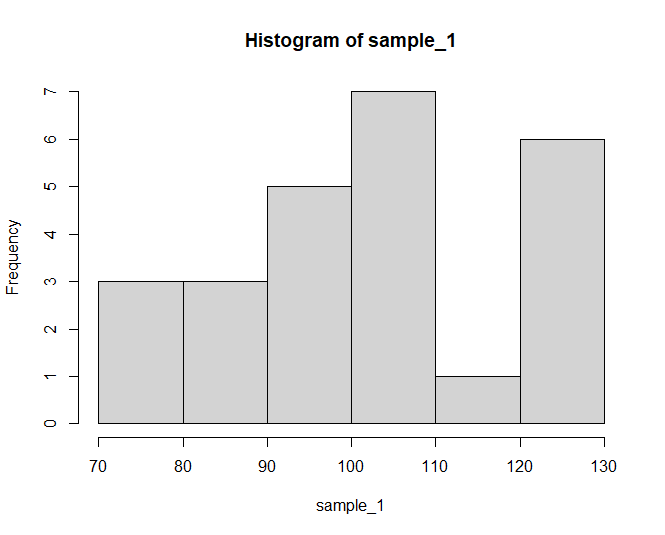
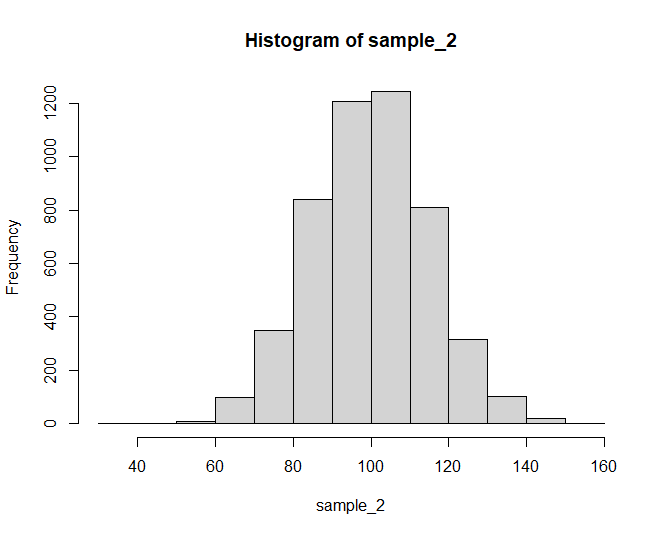
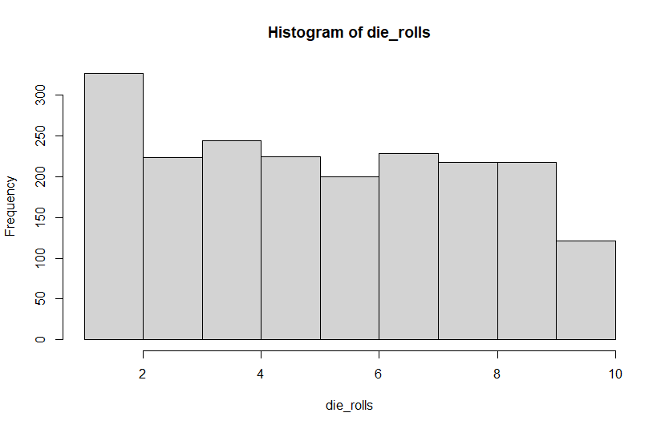
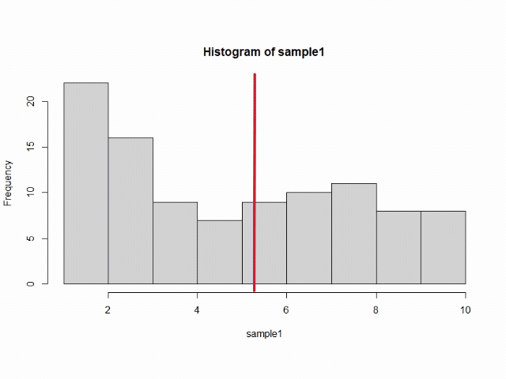
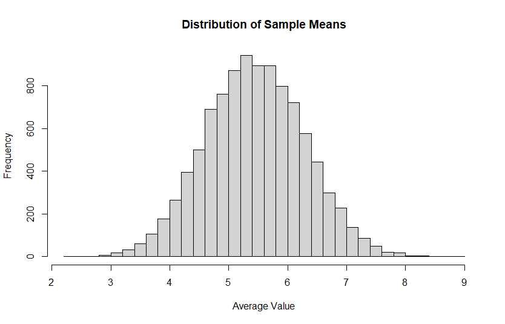
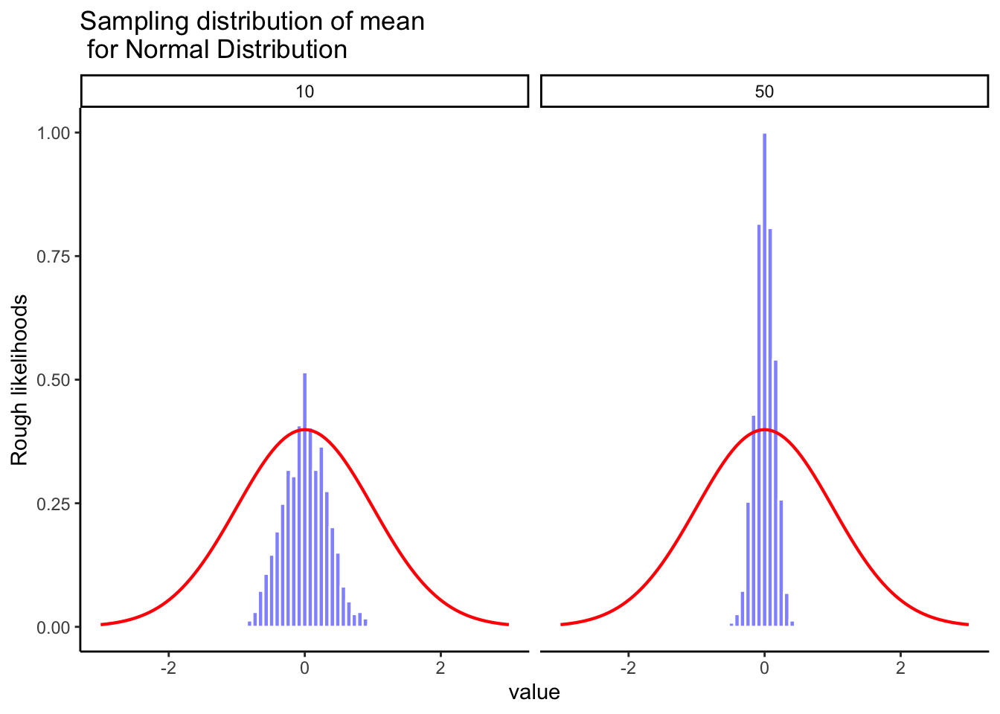
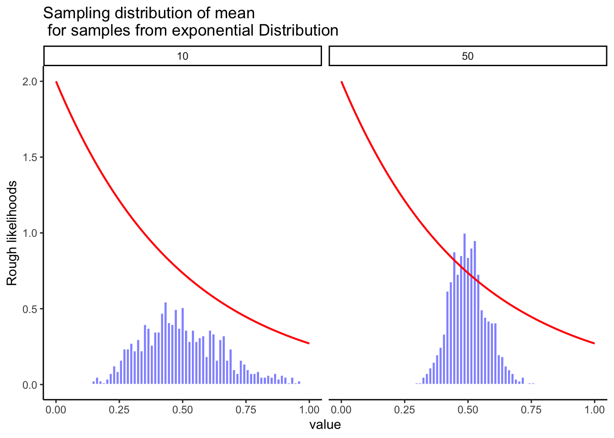

## Learning Objectives {#sec-samples}

- Understand what a population is.

- Understand what a sample is, and some of the ways we might draw a sample from a population.

- Evaluate how a particular sampling method might lead a sample to be a poor representation of a population.

- Understand the concept of a distribution of sample means, and understand how the central limit theorem means that the sample mean distribution will be a normal curve regardless of the population distribution.

- Understand the concept of a "model" and how models can be used to adjust our understanding of social science phenomena.

If you recall back in @sec-fundamentals, I noted that the definition of statistics is "The practice or science of collecting and analyzing numerical data in large quantities, especially for the purpose of inferring proportions in a whole from those in a representative sample." In this chapter, we're going to dive into the last part of that definition – our ability to infer something from a sample.

Also, recall in @sec-design I introduced you to the concept of Theoryland and Dataland. There, we talked about how in Theoryland, we might have a construct we'd like to measure, but that we have to bridge the gap between Theoryland and Dataland by creating an operational definition of our construct, which allows us to measure that variable in the real world and obtain data about that variable.

That analogy is useful in this chapter too, as we think about how we can bridge the gap between a sample we obtain in the real world (Dataland) and what that sample can tell us about the population at hand (Theoryland). In a nutshell, when we talk about "inferring" something from our sample, this is our bridge between Theoryland and Dataland in this context.

### Defining a population

A sample is a concrete thing (i.e., it exists in Dataland). You can open up a data file, and there's the data from your sample. A **population**, on the other hand, is a more abstract idea (i.e., it exists in Theoryland). It refers to the set of all possible people, or all possible observations, that you want to draw conclusions about, and is generally **much** bigger than the sample... so big that it is not possible for us to find everyone in this population if we want to conduct research. In an ideal world, the researcher would begin the study with a clear idea of what the population of interest is, since the process of designing a study and testing hypotheses about the data that it produces does depend on the population about which you want to make statements. However, that doesn't always happen in practice: usually the researcher has a fairly vague idea of what the population is and designs the study as best they can on that basis.

Sometimes it's easy to state the population of interest. For instance, when researchers conduct political polls, the population is typically "all eligible voters at the a time of the study" -- millions of people. So, if I want to learn more about voters, I can probably find a way to sample a few thousand of them to learn more about their opinions. However, a lot of research questions don't necessarily focus on such a specific population. Suppose I run an experiment using 100 undergraduate students as my participants. My goal, as a professor, is to try to discover what teaching techniques are most effective for students. So, which of the following would count as "the population":

- All of the undergraduate psychology students at my institution?

- Undergraduate students in general, anywhere in the world?

- Psychology undergraduate students anywhere in the world?

- People who could potentially become psychology students?

- Anyone currently alive?

- Any human being, past, present or future?

Each of these defines a real group of mind-possessing entities and it's not at all clear which one ought to be the true population of interest.

### Simple random samples

Regardless of how we define the population, the critical point is that the sample is a subset of the population, and our goal is to use our knowledge of the sample to draw inferences about the properties of the population. The relationship between the two depends on the **procedure** by which the sample was selected. This procedure is referred to as a **sampling method**, and it is important to understand why it matters.

To keep things simple, imagine we have a bag containing 10 chips. Each chip has a unique letter printed on it, so we can distinguish between the 10 chips. The chips come in two colors, black and white.

{#fig-srs1}

This set of chips is the population of interest, and it is depicted graphically on the left of @fig-srs1.

As you can see from looking at the picture, there are 4 black chips and 6 white chips, but of course in real life we wouldn't know that unless we looked in the bag. Now imagine you run the following "experiment": you shake up the bag, close your eyes, and pull out 4 chips without putting any of them back into the bag. First out comes the $a$ chip (black), then the $c$ chip (white), then $j$ (white) and then finally $b$ (black). If you wanted, you could then put all the chips back in the bag and repeat the experiment, as depicted on the right hand side of @fig-srs1. Each time you get different results, but the procedure is identical in each case. The fact that the same procedure can lead to different results each time, we refer to it as a **random** process. However, because we shook the bag before pulling any chips out, it seems reasonable to think that every chip has the same chance of being selected. A procedure in which every member of the population has the same chance of being selected is called a **simple random sample**. The fact that we did **not** put the chips back in the bag after pulling them out means that you can't observe the same thing twice, and in such cases the observations are said to have been sampled **without replacement**.

To help make sure you understand the importance of the sampling procedure, consider an alternative way in which the experiment could have been run. Suppose instead that I opened the bag, and decided to pull out four black chips without putting any of them back in the bag. This **biased** sampling scheme is depicted in @fig-brs.

{#fig-brs}

Now consider the evidentiary value of seeing 4 black chips and 0 white chips. Clearly, my biased sampling scheme is problematic. If I admit that I peeked in the bag ahead of time, you should know to be skeptical of my findings. However, if I don't share that my sample is biased, or if I don't realize that this is a bad way to sample, you may come away with the incorrect assumption that there are only black chips in the bag. For this reason, statisticians prefer it when we are transparent about how we sample our population, and ideally, we want a simple random sample because it makes the data analysis **much** easier.

A third procedure is worth mentioning. This time around we close our eyes, shake the bag, and pull out a chip. This time, however, we record the observation and then put the chip back in the bag. Again we close our eyes, shake the bag, and pull out a chip. We then repeat this procedure until we have 4 chips. Data sets generated in this way are still simple random samples, but because we put the chips back in the bag immediately after drawing them it is referred to as a sample **with replacement**. The difference between this situation and the first one is that it is possible to observe the same population member multiple times, as illustrated in @fig-srs2.

{#fig-srs2}

Most psychology experiments tend to be sampling without replacement, because the same person is not allowed to participate in the experiment twice. However, most statistical theory is based on the assumption that the data arise from a simple random sample **with** replacement. In real life, this very rarely matters. If the population of interest is large (e.g., has more than 10 entities!) the difference between sampling with- and without- replacement is too small to be concerned with. The difference between simple random samples and biased samples, on the other hand, is not such an easy thing to dismiss.

### Most samples are not simple random samples

As you can see from looking at the list of possible populations that I showed above, it is almost impossible to obtain a simple random sample from most populations of interest. When I run experiments, I'd consider it a minor miracle if my participants turned out to be a random sampling of the undergraduate psychology students at Minnesota State University, even though this is by far the narrowest population that I might want to generalize to. A thorough discussion of other types of sampling schemes is beyond the scope of this book, but to give you a sense of what's out there I'll list a couple of common strategies:

- **Stratified sampling** is helpful if we can divide the population into different sub-populations (strata). At my institution, the population of students is largely white, so if I wanted to make sure to ensure that other races are well-represented in my data, I might specifically identify other races on campus and purposely sample from those groups. If a group is particularly rare on campus (such as indigenous groups) I might even **oversample** by getting an overly large proportion of those people to ensure I hear their opinions.

- **Snowball sampling** is useful when I need to find a population that is hidden or hard to access. This can be common in social sciences, because we often want to study populations like this. A good example is if I want to get opinions among transgender people – this population is relatively small, and some transgender people may not want to be identified as such because they may not be out to other people, or they may be worried about their safety. So, I would start by finding a group of transgender people who are willing to share their opinion. At the end of my survey, I ask participants to provide contact details for other transgender people who might want to participate. I contact those people, have them take my survey, and then ask them for more contact details. This process continues – much like a snowball rolling down a hill and growing larger as it collects more snow, my sample will "snowball" into a larger sample with the help of my participants. This gets us a lot of hard-to-obtain data. However, we have to be sensitive about the ethics of this sample (i.e., is it OK for a participant to give me someone's contact information, or will they feel this violates their privacy?) It also is definitely **not** a random sample, because we tend to know people with whom we have a lot in common, so there might be other groups of transgender people I'm missing out on that might be very different from the sample I end up with.

- **Convenience sampling** is more or less what it sounds like. The samples are chosen in a way that is convenient to the researcher, and not selected at random from the population of interest. Snowball sampling is one type of convenience sampling, but there are many others. A common example in psychology are studies that rely on undergraduate psychology students. These samples are generally non-random in two respects: firstly, reliance on undergraduate psychology students automatically means that your data are restricted to a single sub-population. Secondly, the students usually get to pick which studies they participate in, so the sample is a self selected subset of psychology students not a randomly selected subset. In real life, most studies are convenience samples of one form or another. This is sometimes a severe limitation, but not always.

### How much does it matter if you don't have a simple random sample?

Okay, so real world data collection tends not to involve nice simple random samples. Does that matter? A little thought should make it clear to you that it **can** matter if your data are not a simple random sample: just think about the difference between @fig-srs1 and @fig-brs. However, it's not quite as bad as it sounds. Some types of biased samples are entirely unproblematic. For instance, when using a stratified sampling technique you actually **know** what the bias is because you created it deliberately, often to **increase** the effectiveness of your study, and there are statistical techniques that you can use to adjust for the biases you've introduced (not covered in this book!). So in those situations it's not a problem.

More generally though, it's important to remember that random sampling is a means to an end, not the end in itself. Let's assume you've relied on a convenience sample, and as such you can assume it's biased. A bias in your sampling method is only a problem if it causes you to draw the wrong conclusions. When viewed from that perspective, I'd argue that we don't need the sample to be randomly generated in **every** respect: we only need it to be random with respect to the psychologically-relevant phenomenon of interest. 

Suppose I'm doing a study looking at working memory capacity. In study 1, I actually have the ability to sample randomly from all human beings currently alive, with one exception: I can only sample people born on a Monday. In study 2, I am able to sample randomly from the Australian population. I want to generalize my results to the population of all living humans. Which study is better? 

The answer, obviously, is study 1. Why? Because we have no reason to think that being "born on a Monday" has any interesting relationship to working memory capacity. In contrast, I can think of several reasons why "being Australian" might matter. Australia is a wealthy, industrialized country with a very well-developed education system. People growing up in that system will have had life experiences much more similar to the experiences of the people who designed the tests for working memory capacity. This shared experience might easily translate into similar beliefs about how to "take a test", a shared assumption about how psychological experimentation works, and so on. These things might actually matter. For instance, "test taking" style might have taught the Australian participants how to direct their attention exclusively on fairly abstract test materials relative to people that haven't grown up in a similar environment; leading to a misleading picture of what working memory capacity is.

There are two points hidden in this discussion. First, when designing your own studies, it's important to think about what population you care about, and try hard to sample in a way that is appropriate to that population. In practice, you're usually forced to put up with a "sample of convenience" (e.g., psychology lecturers sample psychology students because that's the least expensive way to collect data, and our coffers aren't exactly overflowing with gold), but if so you should at least spend some time thinking about what the dangers of this practice might be.

Second, if you're going to criticize someone else's study because they've used a sample of convenience rather than laboriously sampling randomly from the entire human population, at least have the courtesy to offer a specific theory as to **how** this might have distorted the results. Remember, everyone in science is aware of this issue, and does what they can to alleviate it. Merely pointing out that "the study only included people from group X" is entirely unhelpful, and borders on being insulting to the researchers, who are aware of the issue. They just don't happen to be in possession of the infinite supply of time and money required to construct the perfect sample. In short, if you want to offer a responsible critique of the sampling process, then be **helpful**. Rehashing the blindingly obvious truisms that I've been rambling on about in this section isn't helpful.

### Population parameters and sample statistics

Okay. Setting aside the thorny methodological issues associated with obtaining a random sample, let's consider a slightly different issue, which is how that sample relates to the population. The easiest way to talk about this is for us to run a little simulation. Let's say that I'm an all-knowing god-like figure who exists in Theoryland, and therefore I have access to the entire population I want to study. Let's say the population I'm interested in is a tiny slice of people who experience both a button phobia (koumpounophobia) and a fear of otters (lutraphobia). These are both fairly unusual conditions, so let's say that the entire population on the planet of these people is only 10,000 people. And let's say that I want to study this population's IQ. Here in Theoryland, because I'm an all-knowing being, I **know** that the IQ of this population is 100, with a standard deviation of 15. These characteristics of the population are known as **population parameters**. If you use R, it's pretty simple to generate this population using this code:

``` r
population<- rnorm(10000, mean = 100, sd = 15)
```

Unfortunately for us, we live here in Dataland, where it's not possible for us to access the full population. So, instead, I draw a sample from this population. Let's start with a sample of 25 people – a bit on the small side. When I draw this random sample, I can take a look at the **sample statistics** – that is, things like the mean and standard deviation of that sample. I can also take a look at a histogram that shows me the frequency of scores:

{#fig-sample1histo}

In this sample, I see a mean of 102.09 and a standard deviation of 16.12. You can also see that this histogram is a bit lumpy, but it follows a basic bell curve with most scores in the middle, and a few scores that are on the high or low ends of the IQ scores. And we can see that the means and standard deviations are close to the population parameters, but they are not perfect.

Let's try this again with a really big sample – lets say I get 5,000 people.

{#fig-sample2histo}

Here, my mean is 99.87 and my standard deviation is 15.06, which are closer to the parameter values. You'll also notice my histogram is much smoother and looks even more like a normal distribution. Why did this happen?

This phenomenon is known as the **law of large numbers**. The law of large numbers is a mathematical law that applies to many different sample statistics, but the simplest way to think about it is as a law about averages. The sample mean is the most obvious example of a statistic that relies on averaging (because that's what the mean is... an average), so let's look at that. **When applied to the sample mean, what the law of large numbers states is that as the sample gets larger, the sample mean tends to get closer to the true population mean.** Or, to say it a little bit more precisely, as the sample size "approaches" infinity (written as $N \rightarrow \infty$) the sample mean approaches the population mean ($\bar{X} \rightarrow \mu$).

The main takeaway here is that a large sample tends to do a better job of approximating parameters compared to a small sample.

## Sampling distributions and the central limit theorem

The law of large numbers is a very powerful tool, but it's not going to be good enough to answer all our questions. Among other things, all it gives us is a "long run guarantee". In the long run, if we were somehow able to collect an infinite amount of data, then the law of large numbers guarantees that our sample statistics will be correct. But as John Maynard Keynes famously argued in economics, a long run guarantee is of little use in real life:

> \[\*\*The\] long run is a misleading guide to current affairs. In the long run we are all dead. Economists set themselves too easy, too useless a task, if in tempestuous seasons they can only tell us, that when the storm is long past, the ocean is flat again.\*\* [@Keynes1923]

This is true in social science generally. It is not enough to know that we will **eventually** arrive at the right answer when calculating the sample mean. Knowing that an infinitely large data set will tell me the exact value of the population mean is cold comfort when my **actual** data set has a sample size that is much less than infinity. In real life, then, we must know something about the behavior of the sample mean when it is calculated from a smaller data set!

### Sampling distribution of the sample means

So far, we've been talking about a sample or two from a population. But imagine again that we are a god-like entity living in Theoryland. We have infinite resources and time, so imagine that we decide to take infinite samples from the population, and for each sample, I calculate the mean of that sample, and I put each sample mean into a data set. That data set that I create provides something we can call **the sampling distribution of the sampling means.** I know that name is long and awkward, but I don't make the rules around here.

I want to jump into a different example for this topic. Let's say that I want to give a sample of 20 people a 10-sided die and ask them to roll it 10 times, and I record whatever value they roll. If this die is fair, it's equally likely to land on each number, so we see a **uniform distribution** – that is, a flat line that indicates there's a 10% chance of each value being rolled.

{#uniform fig-alt="A histogram that looks roughly uniform across a range of 1 to 20 for a die role"}

So now, let's say that I decide to take 10,000 samples of 10 people rolling dice. For each sample, I record what value people roll, and I add that to my data set and calculate the mean. Here's a little animation that shows how a few of these samples I collect with the mean of each sample indicated by the vertical line:

:::{.content-visible when-format="html"}

{#diesamplegif fig-alt="A gif shows that each sample has a uniform distribution, with the mean being somewhere between 5 and 6."}
:::

:::{.content-visible when-format="pdf"}

{#diesamplegif fig-alt="A QR code that leads to an animation."}

:::


First question: Are all the sample means the same? The answer to this is "No." As you can see in the animation, the vertical line moves around a bit – it tends to stay relatively close to the middle values of 5 and 6, but sometimes it is much higher or lower than that.

Second question: If I continued to do this for 10,000 samples and I kept a record of each sample's mean and put it on a histogram, what would that histogram look like? It's tempting to say that, because this data comes from a uniform distribution, that the distribution would also be uniform. In fact, this is what we see:

{#samplemeans fig-alt="A histogram of sample means that falls into a normal distribution curve"}

What the heck?! How did that happen? Why do we have a normal curve here? The answer is a fancy little thing called the **central limit theorem.** We'll talk about that more in a moment, but let me walk through what exactly is happening here.

First of all, let's think about what the "average" would be if we rolled the dice 10 times and got a perfect uniform distribution where the die turned up each number once. So my data set would be:

1 2 3 4 5 6 7 8 9 10

What's the mean of this? If we calculate it, we find:

$(1+2+3+4+5+6+7+8+9+10)/10 = 5.5$

So, this tells us the mean of each sample should generally be pretty close to 5.5. That won't happen every time, but there are a lot of combinations of numbers that would lead to a sample having a mean of 5.5. For example:

1 2 2 4 5 6 7 8 10 10

3 3 4 4 5 5 7 8 8 8

But there's only one way to get a mean of 1:

1 1 1 1 1 1 1 1 1 1

And there's only one way to get a mean of 10:

10 10 10 10 10 10 10 10 10 10

So, our distribution of sample means shows that it's going to be fairly common to get a sample mean around 5.5, and that it's unusual (but not impossible) to get a mean that's closer to 1 or to 10. But the main point here is that even though our population distribution is uniform, the sampling distribution of sample means is going to be a normal distribution. OK, cool! But why do you need to care about this? The central limit theorem holds the key to this!

## The central limit theorem

Now you've seen lots of sampling distributions, and you know what the sampling distribution of the mean is. Here, we'll focus on **how the sampling distribution of the mean changes as a function of sample size.**

Intuitively, you already know part of the answer: if you only have a few observations, the sample mean is likely to be quite inaccurate (you've already seen it bounce around): if you replicate a small experiment and recalculate the mean you'll get a very different answer. In other words, the sampling distribution is quite wide. If you replicate a large experiment and recalculate the sample mean you'll probably get the same answer you got last time, so the sampling distribution will be very narrow.

Let's give ourselves a nice movie to see everything in action. Let's return to the earlier example using IQ scores. @fig-sampdistgif has four panels, each panel represents a different sample size (n), including sample-sizes of 10, 50, 100, and 1000. The red line shows the shape of the normal distribution. The grey bars show a histogram of each of the samples that we take. The red line shows the mean of an individual sample (the middle of the grey bars). As you can see, the red line moves around a lot, especially when the sample size is small (10).

The new bits are the blue bars and the blue lines. The blue bars represent the sampling distribution of the sample mean. For example, in the panel for sample-size 10, we see a bunch of blue bars. This is a histogram of 10 sample means, taken from 10 samples of size 10. In the 50 panel, we see a histogram of 50 sample means, taken from 50 samples of size 50, and so on. The blue line in each panel is the mean of the sample means ("aaagh, it's a mean of means", yes it is).

::: {.content-visible when-format="html"}

{#fig-sampdistgif}
:::

::: {.content-visible when-format="pdf"}

{fit-alt="A QR that leads to an animation"}

:::

What should you notice? Look at how the range of the blue bars shrinks as sample size increases. The sampling distribution of the mean is quite wide when the sample size is 10, it narrows as sample size increases to 50 and 100. When we get to an enormous sample of 1000 participants, the distribution is just one blue bar in the middle. What we are seeing is that the mean of the sampling distribution approaches the mean of the population as sample size increases. This makes some intuitive sense – if I had a sample that was so big that I was only missing a couple of people from the population, you can bet that my sample mean would be almost exactly the population mean.

The sampling distribution of the mean is just another kind of distribution, and we've already talked about the mean of that sampling distribution. The sampling distribution also has a standard deviation, which we call the **standard error of the sample mean (SEM)**. You can see in the animation that as our sample sizes get larger, the SEM (the range of the blue bars) gets smaller.

Okay, so that's one part of the story. However, there's something we've been glossing over a little bit. We've seen it already, but it's worth looking at it one more time. Here's the thing: **no matter what shape your population distribution is**, as $N$ increases, the sampling distribution of the mean starts to look more like a normal distribution. This is the central limit theorem.

To see the central limit theorem in action, we are going to look at some histograms of sample means from different kinds of distributions. It is very important to recognize that you are looking at distributions of sample means, not distributions of individual samples.

@fig-twonormals shows sampling from a normal distribution. The red line is the normal distribution where each sample is drawn from. The mean for each sample of numbers is computed, and the distribution of sample means is shown by the blue bars. Note that the shape of red line and the blue bars are similar, they both look like a normal distribution.

{#fig-twonormals}

Here's one more example with an exponential distribution (shown in red on @fig-expdist) where smaller numbers are more likely to be sampled than larger numbers. Even though way more of the numbers in a given sample will be smaller than larger, according to the sampling distribution of the mean does not look the red line. Instead, the sampling distribution of the mean looks like a bell-shaped normal curve. This is the central limit theorem in action.

{#fig-expdist}

On the basis of these figures, it seems like we have evidence for all of the following claims about the sampling distribution of the mean:

- The mean of the sampling distribution is the same as the mean of the population

- The standard deviation of the sampling distribution (i.e., the standard error) gets smaller as the sample size increases

- The shape of the sampling distribution becomes normal as the sample size increases

As it happens, not only are all of these statements true, there is a very famous theorem in statistics that proves all three of them, known as the **central limit theorem**. Among other things, the central limit theorem tells us that if the population distribution has mean $\mu$ and standard deviation $\sigma$, then the sampling distribution of the mean also has mean $\mu$, and the standard error of the mean is:

$${S_{\bar X}} = \frac{\sigma}{ \sqrt{N} }$$ {#eq-sem}

Because we divide the population standard deviation $\sigma$ by the square root of the sample size $N$, the $S_{\bar{X}}$ gets smaller as the sample size increases. It also tells us that the shape of the sampling distribution becomes normal.

This result is useful for all sorts of things. It tells us why large experiments are more reliable than small ones, and because it gives us an explicit formula for the standard error it tells us **how much** **more** **reliable** a large experiment is. It tells us why the normal distribution is, well, normal. In real experiments, many of the things that we want to measure are actually averages of lots of different quantities (e.g., arguably, "general" intelligence as measured by IQ is an average of a large number of "specific" skills and abilities), and when that happens, the averaged quantity should follow a normal distribution. Because of this mathematical law, the normal distribution pops up over and over again in real data.

## Models: Ways of Understanding the World

There's one more concept that fits well here, and that's the concept of creating a **model**. It sounds fancy, but all it means is that I'm using my data to try and predict and/or understand some sort of variable in the world. If you can measure something, you can build a model around it. For example, if I want to understand why some students procrastinate on their homework and others don't, I might measure a number of variables (personality, perfectionism, smartphone addiction, physical activity) and some of those variables might help me predict which students are likely to procrastinate.

One of the simplest models we can build is simply using the mean. If I know nothing at all about a student, and I'm asked to make a guess about how much they procrastinate, I might get a sample of participants and see what the average level of procrastination is for them, and use that as my best guess for how this mystery student will behave. As I learn more about procrastination, I might be able to adjust my estimate up or down if I know something about this student. For example, if I know they are highly perfectionistic, I might expect that they will be higher in procrastination; if I know they don't have a smartphone, I might expect they will be lower in procrastination. Ultimately, if another variable provides a better prediction than just the average score on procrastination, it's likely a useful variable. Building models is ultimately the goal of statistics in social sciences, so we'll talk a lot about models and how well data fits a model in future chapters.
